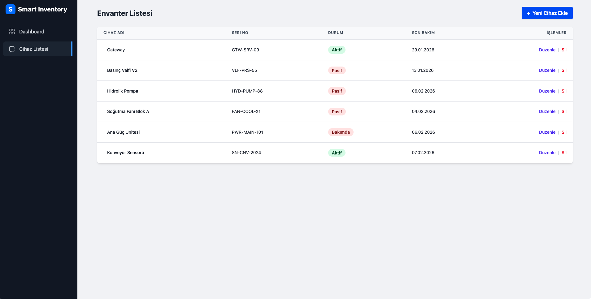
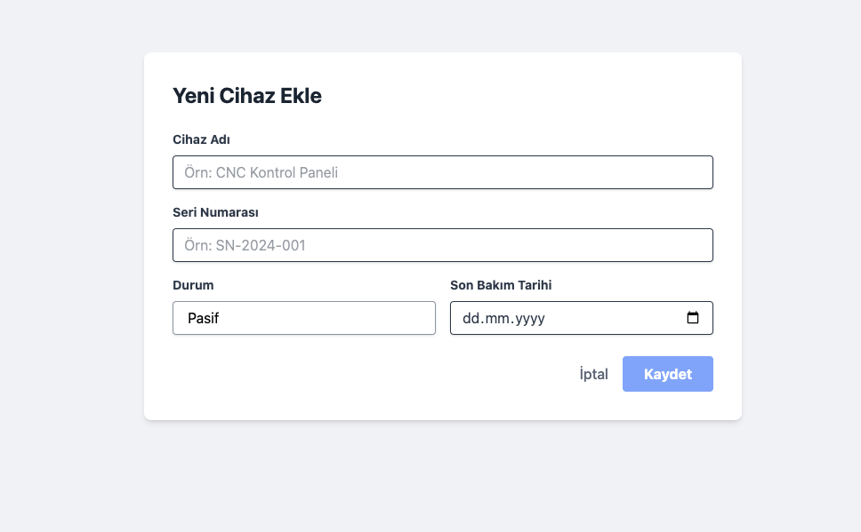
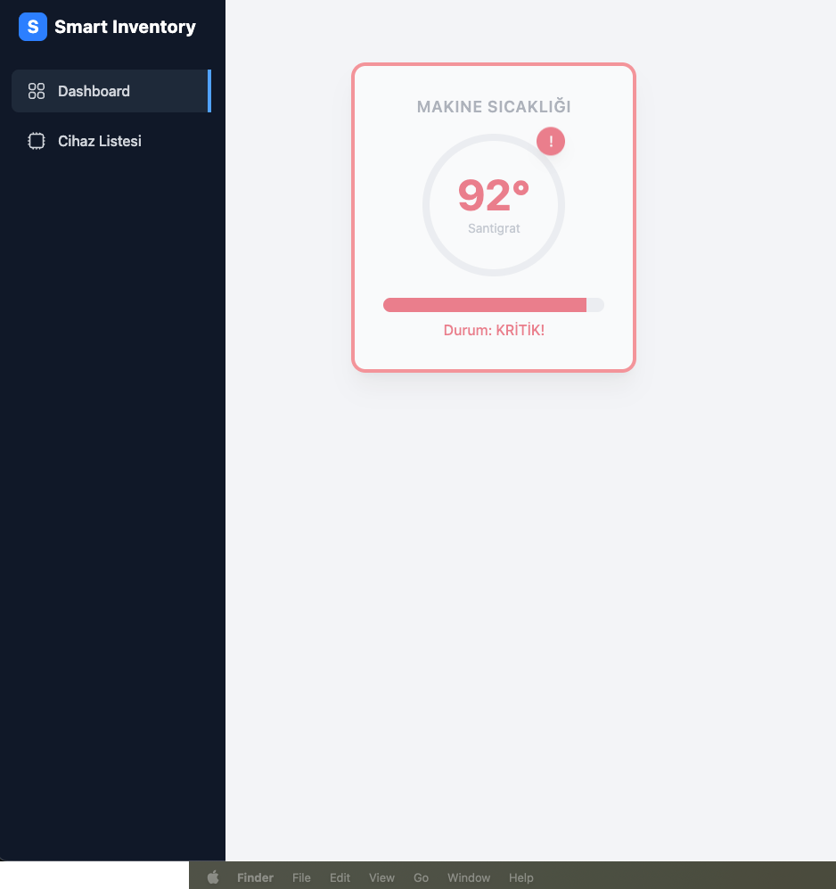

# 📦 Smart Inventory Management System

Bu proje, modern fabrika ve depo envanter takibi için geliştirilmiş **Full-Stack** bir uygulamadır. **Angular 17+** ve **.NET 8** teknolojilerini birleştirerek, **SignalR** üzerinden gerçek zamanlı veri akışı sağlar.


## 🚀 Özellikler

- **📊 Canlı Dashboard:** SignalR (WebSocket) ile anlık sıcaklık ve sensör verisi takibi.
- **⚡ Gerçek Zamanlı Bildirimler:** Kritik seviyeler ve işlem durumları (Toast Notification) anında ekrana yansır.
- **🛠️ Cihaz Yönetimi (CRUD):** - Modal (Popup) mimarisi ile sayfa yenilemeden hızlı ekleme/güncelleme.
  - Akıllı validasyonlar (Örn: Mükerrer seri numarası kontrolü).
- **🐳 Docker Entegrasyonu:** Veritabanı ve servislerin konteynerize edilmiş yapısı.
- **📱 Responsive Tasarım:** Mobil ve masaüstü uyumlu modern arayüz.

## 📸 Ekran Görüntüleri

Projenin arayüz akışı aşağıdadır:

### 1. Ana Liste Görünümü

Tüm cihazların listelendiği ve durumlarının (Aktif/Pasif) takip edildiği ana ekran.



---

### 2. Cihaz Yönetimi (Modal)

Sayfa yenilenmeden açılan pop-up formlar ile hızlı veri girişi.

|                      Yeni Cihaz Ekleme                       |                          Cihaz Güncelleme                           |
| :----------------------------------------------------------: | :-----------------------------------------------------------------: |
|  |  |
|                 _Validasyonlu Ekleme Formu_                  |                    _Mevcut Verilerle Düzenleme_                     |

---

### 3. Durum Bildirimleri

Sistem durumuna göre kullanıcıya verilen anlık geri bildirimler.

|                    Kritik Hata / Yüksek Sıcaklık                     |                   Normal Durum / Başarılı İşlem                    |
| :------------------------------------------------------------------: | :----------------------------------------------------------------: |
|  |  |

## ⚙️ Kurulum ve Başlatma (Hızlı Yöntem 🚀)

Proje, geliştirme ortamında **tek komutla** ayağa kalkacak şekilde yapılandırılmıştır.

### Ön Gereksinimler

- [Node.js](https://nodejs.org/) (v18+)
- [.NET 8 SDK](https://dotnet.microsoft.com/download)
- [Docker Desktop](https://www.docker.com/products/docker-desktop) (Veritabanı için gereklidir)

### Adım 1: Projeyi Klonlayın

```bash
git clone ""
cd SmartInventory
```
