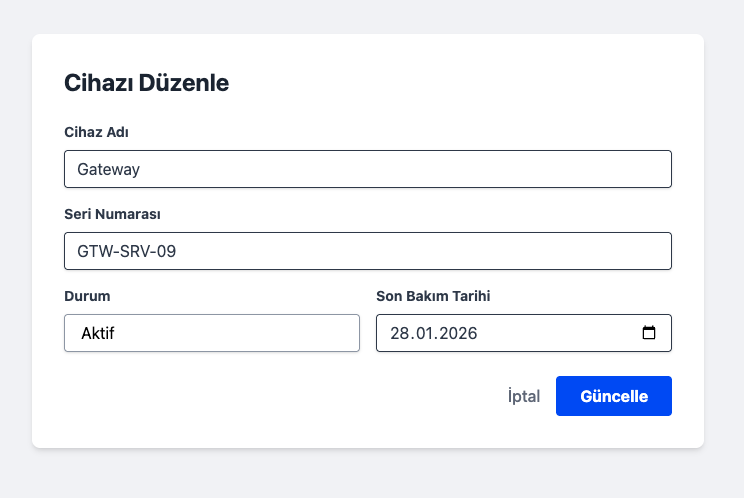
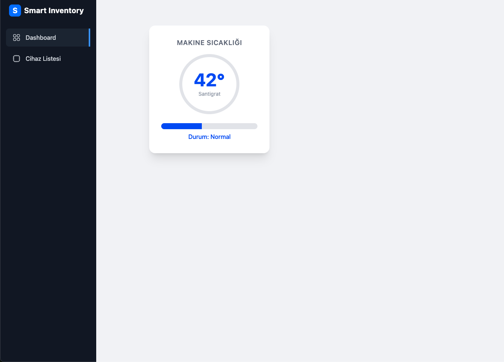

# Smart Inventory Management UI

Bu proje, fabrika ve depo envanter takibi için geliştirilmiş modern bir web arayüzüdür. **Angular** (Standalone Components) mimarisi ile geliştirilmiş olup, gerçek zamanlı sensör takibi ve cihaz yönetimi özelliklerine sahiptir.


## Özellikler

- **📊 Canlı Dashboard:** SignalR (WebSocket) üzerinden gelen sıcaklık verilerini anlık olarak gösteren dinamik ibre (Gauge).
- **📝 Cihaz Yönetimi (CRUD):**
  - Cihazları listeleme, ekleme, düzenleme ve silme.
  - Sayfa yenilenmeden çalışan **Modal (Popup)** tabanlı form yapısı.
- **⚡ Validasyonlar:**
  - Reactive Forms ile güçlü veri doğrulama.
  - **Benzersiz Seri No:** Aynı seri numarasına sahip cihaz eklenmesini engelleyen akıllı kontrol.
- **🎨 Modern Tasarım:** Tailwind CSS ile oluşturulmuş responsive (mobil uyumlu) arayüz.
- **🛣️ Routing:** Sayfalar arası hızlı geçiş (Dashboard, Cihazlar vb.).

## Kullanılan Teknolojiler

- **Frontend Framework:** Angular 17+ (Standalone Components)
- **Styling:** Tailwind CSS
- **Real-time Communication:** Microsoft SignalR Client
- **State Management:** RxJS & Signals
- **Icons:** Heroicons (SVG)

## ⚙️ Kurulum ve Çalıştırma

Projeyi yerel makinenizde çalıştırmak için aşağıdaki adımları izleyin.

### 1. Projeyi Klonlayın

```bash
git clone "https://github.com/HalilllYlmz/SmartInventoryUI.git"
cd smart-inventory-ui
```

### 2. Bağımlılıkları Yükleyin

```bash
npm install
```

### 3. Backend Bağlantısını Kontrol Edin

Uygulamanın düzgün çalışması için .NET tabanlı API'nin çalışıyor olması gerekir. src/app/services/signalr.ts ve inventory.ts dosyalarındaki API URL'lerinin (örn: http://localhost:5113) backend portunuzla eşleştiğinden emin olun.

### 4. Uygulamayı Başlatın

```bash
npm start
```

## Proje Klasör Yapısı (Özet)

    src/
    ├── app/
    │ ├── components/
    │ │ ├── navbar/
    │ │ ├── sidebar/
    │ │ └── temperature-gauge/
    │ ├── models/
    │ ├── pages/
    │ │ ├── dashboard/
    │ │ └── device-list/
    │ ├── services/
    │ │ ├── signalr.ts
    │ │ └── inventory.ts
    │ └── app.routes.ts
    └── styles.css

## Ekran Görüntüleri

Projenin arayüz akışı aşağıdadır:

### 1. Ana Liste Görünümü

Tüm cihazların listelendiği ve durumlarının (Aktif/Pasif) takip edildiği ana ekran.


---

### 2. Cihaz Yönetimi

|                      Yeni Cihaz Ekleme                       |                          Cihaz Güncelleme                           |
| :----------------------------------------------------------: | :-----------------------------------------------------------------: |
|  |  |
|                 _Validasyonlu Ekleme Formu_                  |                    _Mevcut Verilerle Düzenleme_                     |

---

### 3. Durum Bildirimleri

Sistem durumuna göre kullanıcıya verilen anlık geri bildirimler.

|                           Yüksek Sıcaklık                            |                            Normal Durum                            |
| :------------------------------------------------------------------: | :----------------------------------------------------------------: |
|  |  |
